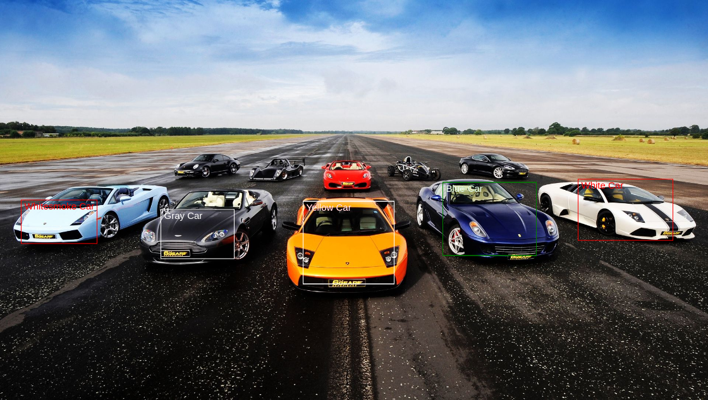

#### NodeJS || MongoDB || Mongoose || React || React-Hooks || Redux || Typescript || Canvas || 2D Bounding Boxes
The 2D bounding box annotation is available for driving cars, or any other visual perception for AI based model development. The visual based perception model becomes aware with various types of objects through 2D bounding box image annotation techniques for various fields.
<br/>



#### Requirements
#### `
MongoDB
Node 12.16.1 / Latest Version
`


Below you will find some information about project structure
#### Folder Structure

Project should look like this:

```
bounding-box-labelling/
    backend/
        controllers/
            BoundingboxController.js
        models/
            Boundingbox.js
        routes/
            Boundingbox.js   
        index.js
        package.json
        package-lock.json          
    frontend/
        public/
            BoundingboxController.js
        src/
            actions/ 
                actionTypes.ts
                boundingboxAction.ts
                InterfaceTypes.ts
            components/
                common/
                    Canvas.tsx
                    InputForm.tsx
                    InterfaceTypes.tsx
                    Labelling.tsx
                    List.tsx
                    style.css
                AddItem.tsx 
                ItemList.tsx 
                Preview.tsx 
            reducers/
                boundingboxReducer.ts 
                rootReducer.ts 
            services/
                api.ts
                service.ts 
            store/
                index.ts
            App.css 
            App.test.tsx 
            index.css
            index.tsx
            react-app-env.d.ts
            serviceWorker.ts 
            setupTests.js 
        .env
        package.json
        package-lock.json
        README.md 
        tsconfig.json
        yarn.lock
```
Below you will find some information on how to perform common tasks.<br>

### Learn More
Learn more from the https://nodejs.org <br/>
Learn more from the https://mongoosejs.com <br/>
Learn more from the https://reactjs.org <br/>
Learn more from the https://redux.js.org

### How To Run Project
#### Run both Backend & Frontend 

From Backend project directory, you can run:

#### `npm start`

From Frontend project directory, you can run:

#### `npm start`

Then Open http://localhost:3000 
<br/> to view it in the browser.
